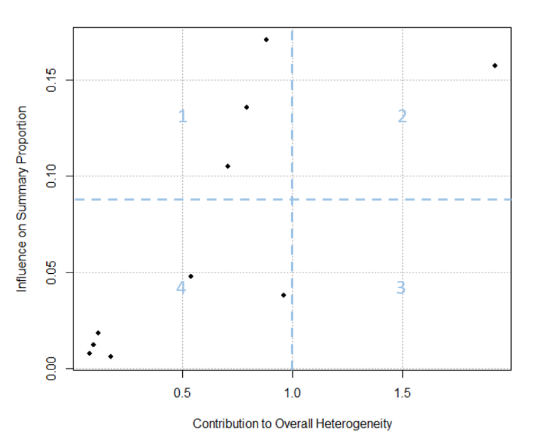

```{r}
#if (!require("pacman")) install.packages("pacman")

pacman::p_load(tidyverse,dplyr,binom, ggplot2, meta, metafor)
```

# **What is a meta-analysis?**

Meta-analysis can be defined as a statistical tool or a formal process of combining the results from multiple studies [@dohoo2014]. This allows the analysis of the results from various scientific studies, which are often not performed in the same place or using the same method [@hackenberger2020bayesian]. Notably, both randomized clinical trials and observational studies are prone to a wide range of biases, and meta-analysis may lend spurious precision to questionable results. Therefore, the focus of meta-analysis of observational studies should be an evaluation of heterogeneity [@dohoo2014].

# **What is a proportion study?**

“Proportion study” is a study where the main outcome is a **proportion (e.g., prevalence, incidence, percentage)** of an event in a population.

For example:

-   25 people with epilepsy out of 100 participants
-   18% prevalence of a disease in a community

# **Why the meta-analysis of proportion is different?**

Most meta-analyses aim to evaluate the effect of an intervention or exposure compared with a comparator. The result is a pooled estimate of effect size which includes risk ratio, odds ratio, incidence rate ratio, or mean difference [@barker2021conducting]. In contrast, systematic reviews of studies estimating the proportion of a particular disease or health status typically involve a single study group, and the outcomes (e.g., prevalence, incidence, etc.) do not behave like conventional effect sizes. Some characteristics of the proportion are as follows:

-   Proportions are bounded between 0 and 1, and do not behave like normal continuous data
-   Variances are not constant
-   Zero-event studies can happen. In that case, variance may become zero.
-   Heterogeneity is usually very high

Let examine the characteristics of the proportion. Here,

1.  We will first create a data set with variables: **Study**, **n**: Study population, and **y**: Event.
2.  Then, we will calculate proportions and related variance.
3.  Then, we will examine the characteristics of proportion data.

## **1. Proportions are bounded between 0 and 1**

```{r}
## Create data set
set.seed(123)

data <- data.frame(
  Study = paste0("Study_", 1:1000),
  n = sample (1:1000,1000)
)

data$y <- mapply(function(n) sample(0:n,1), data$n)


## Calculate the propotion
data$p <- data$y/data$n

## Calculate variance (= p[1-p]/n)
data$var_p <- (data$p*(1-data$p))/data$n


## Plot the proportion (Character 1)
ggplot(data,aes(Study,p))+
  geom_hline(yintercept = 0, color = "blue", linewidth = 0.5)+
  geom_hline(yintercept = 1, color = "blue", linewidth = 0.5)+
  geom_point(alpha = 0.5)
  

```

## **2. Variances are not constant**

This can be visualize as -

```{r}
## Plot the variance
ggplot(data,aes(Study,var_p))+
  geom_hline(yintercept = 0, color = "red", linewidth = 0.5)+
  geom_hline(yintercept = max(data$var_p), color = "red", linewidth = 0.5)+
  geom_point(alpha = 0.5)
```

Or as **Raw proportions** vs **variance**

```{r}
## Plot the variance
ggplot(data,aes(p,var_p))+
  geom_hline(yintercept = 0, color = "red", linewidth = 0.5)+
  geom_hline(yintercept = max(data$var_p), color = "red", linewidth = 0.5)+
  geom_point(alpha = 0.5)
```

## **3. Zero-event studies can happen**

```{r}
data_0 <- data %>% filter(p == 0)
data_0 
```

Look at the column of variance (var_p). They are zeros.

## **4. Heterogeneity is usually very high**

```{r}
mean_p <- mean(data$p, na.rm = TRUE)
## Plot the proportion (Character 1)
ggplot(data,aes(Study,p))+
  geom_point(alpha = 0.5) +
  geom_hline(yintercept = 0, color = "blue", linewidth = 0.5)+
  geom_hline(yintercept = 1, color = "blue", linewidth = 0.5)+
  geom_abline(intercept = mean_p, slope = 0, color = "red")
```

Let's check the distributions of the proportions

```{r}
ggplot(data,aes(p))+
  geom_density(color = "red",
               fill = "skyblue")+
  geom_histogram(aes(y = after_stat(density)),
                 fill = "grey",
                 color = "black",
                 bins = 30,
                 alpha = 0.3) +
  theme_classic()
```

***Are they look like normal?***

But, when conducting a meta-analysis of proportions (pooling a single proportion across multiple studies), several foundational assumptions must be met to ensure the statistical validity and clinical relevance of your pooled estimate. Among several assumptions one most important assumption is the normality of the effect sizes (i.e., proportions).

# **How can we normalize the data?**

To stabilize variance and improve normality, proportions can be transformed to another scale. Some such transformations are -

-   Logit transformation
-   Log transformation
-   Arcsine transformation
-   Freeman–Tukey double arcsine transformation

## **1. Logit transformation**

Let see what happen to our example proportions if we apply logit transformation to them.

$$
Logit (p) = log (\frac{p}{1-p})
$$

```{r}
## Perform logit transformation of the proportions and plot them
data %>% 
  filter(p>0,p<1) %>% # Here, we are losing some data where data has 0% or 100% proportion
  mutate(lg_p = log(p/(1-p))) %>% 
  ggplot(.,aes(x = lg_p))+
  geom_density(color = "red",
             fill = "skyblue")+
  theme_classic()+
  theme(axis.title.y = element_blank(),
        axis.text.y = element_blank(),
        axis.ticks.y = element_blank()) 
```

**If we don't want to loss the data from the studies with 0% and 100% event, we need continuity-correction.**

*"Continuity-corrected proportion usually refers to adjusting a sample proportion by adding a small factor (commonly 0.5) to the numerator and 1 to the denominator."*

Let's do that (we have to do the correction for all proportions)

```{r}
data %>% 
  mutate(p_cc = (p*n + 0.5)/(n + 1)) %>% 
  mutate(lg_p = log(p_cc/(1-p_cc))) %>% 
  ggplot(.,aes(x = lg_p))+
  geom_density(color = "red",
             fill = "skyblue")+
  theme_classic()+
  theme(axis.title.y = element_blank(),
        axis.text.y = element_blank(),
        axis.ticks.y = element_blank()) 
```

See what happened with variance now. An approximation of variance of logit transformed proportions could be -

$$
Var(logit(p)) = \frac{1}{np(1-p)}
$$

```{r}
## Calculate variance and plot them
data %>% 
  mutate(p_cc = (p*n + 0.5)/(n + 1)) %>% 
  mutate(lg_p = log(p_cc/(1-p_cc))) %>% 
  mutate(var_lg_p = 1/(n*p_cc*(1-p_cc))) %>% 
  ggplot(.,aes(x = lg_p, y = var_lg_p))+
  geom_point(alpha=0.5)+
  geom_smooth(method = "loess", se = FALSE, formula = y ~ x)+
  theme_minimal()

```

The plots show a **successful partial stabilization**, but not enough to assume homoscedasticity.

## **2. Log transformation**

***log(p)***

```{r}
data %>% 
  mutate(p_cc = (p*n + 0.5)/(n + 1)) %>% 
  mutate(log_p = log(p_cc)) %>% 
  ggplot(.,aes(x = log_p))+
  geom_density(color = "red",
             fill = "skyblue")+
  theme_minimal()
```

***log(p) vs Var(log(p))***

```{r}
data %>% 
  mutate(p_cc = (p*n + 0.5)/(n + 1)) %>% 
  mutate(log_p = log(p_cc)) %>% 
  mutate(var_log_p = (1-p_cc)/(n*p_cc)) %>% # another alternative = (1/y) - (1/n)
  ggplot(.,aes(x = log_p, y = var_log_p))+
  geom_point(alpha=0.5)+
  geom_smooth(method = "loess", se = FALSE, formula = y ~ x)+
  theme_minimal()
```

## **3. Arcsine transformation**

***arcsine(p)***

```{r}
data %>% 
  mutate(as_p = asin(sqrt(p))) %>% 
  ggplot(.,aes(x = as_p))+
  geom_density(color = "red",
             fill = "skyblue")+
  theme_minimal()
```

***arcsine(p) vs var (arcsine(p))***

```{r}
data %>%  
  mutate(as_p = asin(sqrt(p))) %>% 
  mutate(var_as_p = 1/(4*n)) %>% 
  ggplot(.,aes(x = as_p, y = var_as_p))+
  geom_point(alpha=0.5)+
  geom_smooth(method = "loess", se = FALSE, formula = y ~ x)+
  theme_minimal()
```

## **4. Freeman–Tukey double arcsine transformation**

***doublearcsine(p)***

```{r}
data %>%  
  mutate(das_p = asin(sqrt(y/(n+1))) + asin(sqrt((y+1)/(n+1)))) %>% 
  ggplot(.,aes(x = das_p))+
  geom_density(color = "red",
             fill = "skyblue")+
  theme_minimal()
```

***doublearcsine(p) vs var(doublearcsine(p))***

```{r}
data %>%  
  mutate(das_p = asin(sqrt(y/(n+1))) + asin(sqrt((y+1)/(n+1)))) %>% 
  mutate(var_das_p = 1/(n + 0.5)) %>% 
  ggplot(.,aes(x = das_p, y = var_das_p))+
  geom_point(alpha=0.5)+
  geom_smooth(method = "loess", se = FALSE, formula = y ~ x)+
  theme_minimal()
```

**So far, we have observed that the logit transformation performs better in improving normality and reducing variance instability. Now, we can go for conducting meta-analysis.**

# **Conducting meta-analysis**

## **1. Choosing the model**

The two main parametric models used to combine results from multiple studies are the fixed-effect (FE) and random-effects model (RE).

The FE model assumes that the true proportion is identical across studies included in meta-analysis, and any observed variation in proportion estimates is only due to random sampling error within each study, known as within-study variance.

In contrast, the RE model assumes the true proportions are not the same across studies but follow a normal distribution.

In other words, the RE model accounts for both within-study and between-study variances, while the FE model assumes that the between-study variance is zero (i.e., between-study heterogeneity does not exist) [@hackenberger2020bayesian; @wang2023conducting]. Hackenberger (2020) suggested the use of an FE model if there is no statistical or methodological heterogeneity and if it is not necessary to generalize the conclusions. If a generalized conclusion is the objective and data are available from more than five different studies, a RE model would be appropriate [@hackenberger2020bayesian; @munn2015methodological].

The random-effects model can be estimated by several methods such as -

-   the method of moments or the DerSimonian and Laird method (DL) and
-   the restricted maximum likelihood method (REML)

In all cases, the summary effect size (i.e., the summary proportion) is estimated as the weighted average of the observed effect sizes extracted from primary studies. The weighting for each observed effect size is the inverse of the total variance of a study, which is the sum of the within-study variance and the between-study variance. These two methods differ mainly in the estimation of the between-study variance, commonly denoted as *τ^2^* in the meta-analytic literature [@wang2023conducting].

## **2. Estimating summary estimates**

The data from multiple studies can be combined following two approaches: (i) classical inverse variance meta-analysis (also known as the two-step method) and (ii) meta-analysis based on generalized linear mixed model (GLMM) [@lin2020meta; @schwarzer2021meta].

**Note:** In practice, meta-analyses of proportion studies rarely include a very large number of studies (e.g., 1000 studies). For easier visualization and demonstration of the modeling process, we will use the first 20 studies in our examples.

### **A. Classical inverse variance meta-analysis (two-step method)**

This method requires the estimation of the study-specific proportion (or transformed proportion) and its variance (or standard error) in the first step, followed by a second step where the results from multiple studies are combined to get the pooled proportion estimate.

#### ***i) A naive way to apply this method will be using `metagen()` function from `meta` package: Only for logit transformed proportions***

```{r}

## Transform the proportion (Step-1)
data1 <- data %>% 
  slice(1:20) %>% 
  mutate(p_cc = (y + 0.5)/(n + 1),
         lg_p = log(p_cc/(1-p_cc)),
         var_lg_p = 1/(n*p_cc)+1/(n*(1-p_cc)),
         se_lg_p = sqrt(var_lg_p))

## Pool transformed proportions (Step-2)
model1 <- metagen(
   TE = lg_p,
   seTE = se_lg_p,
   studlab = Study,
   data = data1
 )

summary(model1)
```

We need back transformation

```{r}
inv_logit <- function(x) exp(x) / (1 + exp(x))

pooled_logit <- model1$TE.random
se_logit <- model1$seTE.random

ci_logit <- c(
  pooled_logit - 1.96 * se_logit,
  pooled_logit + 1.96 * se_logit
)

pooled_proportion <- round(inv_logit(pooled_logit)*100,2)
ci_proportion <- round(inv_logit(ci_logit)*100,2)

paste0(pooled_proportion,"%", " (95%CI: ",ci_proportion[1],"%"," - ",ci_proportion[2],"%", ")")


```

**However, a comprehensive details of this method has been described by [@wang2023conducting]. Now, we will follow that method**

#### ***ii) Calculate effect size and variance for each study using different transformations***

Here, “ies” (short for individual effect size)

**A) Without transformation of proportions**

```{r}

data1 <- data %>% 
  slice(1:20)  
# Create a table with effect sizes and SEs
ies <- escalc(xi = y, 
         ni = n,
         data = data1,
         measure="PR") # measure (=computational method) "PR" used for no transformation
       

#Pool the derived effect sizes

pes <- rma(yi, #“pes”, which stands for pooled effect size.
           vi, 
           data = ies, 
           method = "REML")
print (pes)
```

**B) With *logit* transformation of proportions**

```{r}
# Create a table with effect sizes and SEs

ies.logit <- escalc(xi = y, 
         ni = n,
         data = data1,
         measure="PLO") # measure (=computational method) "PLO" used for logit transformation
       

#Pool the derived effect sizes

pes.logit <- rma(yi, #“pes”, which stands for pooled effect size.
           vi,
           data = ies.logit)

# Inverse of logit transformation

pes_predict <- predict (pes.logit, transf = transf.ilogit)

print (pes_predict)
```

**C) With *double arcsine* transformation of proportions**

```{r}
# Create a table with effect sizes and SEs

ies.da <- escalc(xi = y, #da for double arcsine
         ni = n,
         data = data1,
         measure="PFT") # measure (=computational method) "PFT" used for double arcsine transformation transformation
       

#Pool the derived effect sizes

pes.da <- rma(yi, #“pes”, which stands for pooled effect size.
           vi,
           data = ies.da)

# Inverse of double arcsine transformation

pes_predict <- predict (pes.da, transf = transf.ipft.hm, targ = list(ni = data1$n))

#Alternatively we can do back transformation as foloows:

# (I just don't want to use this way at this moment,That is why i am putting the "#" before code) 
#pes_predict <- predict (pes.da , transf = transf.ipft.hm, targ = list (ni =1/( pes.da$se )^2) )

print (pes_predict)
```

Here, we will use the logit transformation. As I mentioned earlier, we can estimate RE model using different estimator. Now, we will do that

#### ***iii) RE model estimation with different estimators (only logit transformed data)***

**A) DL: Most popular method**

```{r}
   
ies.logit <- escalc(xi = y, 
         ni = n,
         data = data1,
         measure="PLO") 
       
#Pool the derived effect sizes

pes.logit_dl <- rma(yi, 
           vi,
           data = ies.logit,
           method = "DL",
           level = 95)

# Inverse of logit transformation

pes_predict_dl <- predict (pes.logit_dl, transf = transf.ilogit)

print (pes_predict_dl)
```

**This is our chosen model**

**B) REML**

```{r}
#Pool the derived effect sizes

pes.logit_reml <- rma(yi, #“pes”, which stands for pooled effect size.
           vi,
           data = ies.logit,
           method = "REML")

# Inverse of logit transformation

pes_predict <- predict (pes.logit_reml, transf = transf.ilogit)

print (pes_predict)
```

**C) ML**

```{r}
#Pool the derived effect sizes

pes.logit_ml <- rma(yi, #“pes”, which stands for pooled effect size.
           vi,
           data = ies.logit,
           method = "ML")

# Inverse of logit transformation

pes_predict <- predict (pes.logit_ml, transf = transf.ilogit)

print (pes_predict)
```

### **B. Meta-analysis based on generalized linear mixed model (GLMM)**

As an alternative to the classical inverse variance method, GLMM can be used to conduct meta-analysis of proportions. The major advantage of this method is that it does not require any data transformation or manual variance calculation at the study level. GLMMs can directly model the even counts (cases) with a binomial likelihood.

For \\(K\\) independent studies, if $y_i$ , $n_i$ , $p_i$ , and $\varepsilon_i$ represent the number of case (or event), sample size, true proportion and random-effects for study *i*, GLMM can be specified as follows:

**Likelihood**:

$$
 y_i \sim \text{Binomial}(n_i,p_i)
$$

**Link function**:

$$
\text{logit}(p_i) = \mu + \varepsilon_i
$$

**Random effects:**

$$
\varepsilon_i \sim \text{Normal}(0,\tau^2)
$$

Here, *P* is the overall proportion on the transformed scale, and *τ^2^* is the between-study variance. Various links (i.e., transformation) are widely used in GLMMs, including the identity, log, logit, probit, cauchy, etc. The synthesized pooled estimate is required to be back-transformed into the original proportion scale if a link function other than identity is used.

**=============*We will discuss GLMM method in another tutorial =======***

## **3. Presentation of results (forest plot)**

**Forest plot for our naive way**

```{r}
#| fig.width: 10
#| fig.height: 8

forest(model1)
```

**Forest plot for the meta-analysis of raw proportion**

```{r}

#| fig.width: 10
#| fig.height: 8

forest(pes)
```

**Forest plot for the meta-analysis of raw proportion logit transformed proportions**

```{r}

#| fig.width: 10
#| fig.height: 8

forest(pes.logit_dl)
```

The forest plot does not look good to me. To make a pretty forest plot I will rerun the meta-analysis using *`metaprop()`* function.

```{r}
pes.logit_2 <- metaprop(y,
                         n,
                         Study,
                         data = data1,
                         sm = "PLO",
                         method = "Inverse",
                         method.tau = "DL",
                         method.ci = "NAsm")

summary(pes.logit_2)

```

**Final plot**

```{r}
#| fig.width: 10
#| fig.height: 8

forest(pes.logit_2,
       common = FALSE,
       print.tau2 = TRUE,
       print.Q = TRUE,
       print.pval.Q = TRUE,
       print.I2 = TRUE,
       leftcols = c("studlab", "event", "n"),
       leftlabs = c("Study", "Cases", "Total"),
       xlab = "Prevalence",
       digits = 2,
       col.square = "navy",
       col.square.lines = "navy",
       col.diamond = "maroon",
       col.diamond.lines = "maroon")
```

## **4. Estimation of the heterogeneity**

There are three quantifying statistics for heterogeneity.

*1) The between-study variance (tau\^2)*: Also known as tau-squared statistic.It reflects the total amount of systematic difference in effects across studies.Sensitive to sample size of the studies included

*2) Test of heterogeneity: Cochran’s Q* : The statistical power of the Q-test heavily relies on the number of studies included in a meta-analysis, and as a result, it may fail to detect heterogeneity due to limited power when the number of included studies is small (less than 10) or when the included studies are of small size. It only assesses the viability of the null hypothesis and does not provide a quantification of the magnitude of the true heterogeneity in effect sizes

*3) I\^2 statistic*: unaffected by the number of included studies.I2 can take values from 0% to 100%. A value of 0% indicates that all heterogeneity is caused by sampling error alone, requiring no further explanation. I2 Conversely, when equals 100%, the entire heterogeneity can be attributed ex clusively to genuine differences between studies, thus justifying the application of subgroup analyses or meta-regressions to identify potential moderating factors.As a thumb rule, 25%, 50%, and 75% are commonly used to indicate low, medium, and high heterogeneity, respectively.

```{r}

print(pes.logit_dl)
confint(pes.logit_dl)
```

## **5. Exploration of sources of heterogeneity**

This included subgroup analysis and meta-regression; however, these methods will not be demonstrated in this example.

## **6. Identifying the influential studies**

### **A. Identifying outlying and influential studies with diagnostic tools (Baujat plot)**

**General description**

{width="361"}

The Baujat plot helps distinguish between outliers that are influential and those that are not [@wang2023conducting]:

-   Small studies with effect sizes similar to others typically fall into the lower left corner of Quadrant 4, indicating they are neither outliers nor influential. **Q4: not-influential-not-outlier**
-   Small studies with notably different effect sizes than others often appear in the lower right corner of Quadrant 3. They may be outliers, but their small sample sizes prevent them from heavily impacting the overall effect size. **Q3: not-influential-outlier**
-   Large studies with dramatically different effect sizes than the rest tend to appear in the upper right corner of Quadrant 2. These studies are influential outliers, exerting the most substantial impact on both the overall effect and heterogeneity. **Q2: influential-outlier**
-   Large studies with effect sizes similar to the majority of effect sizes tend to populate the upper left corner of Quadrant 1. While these studies have influential effects, they may not be outliers. Their influence on the pooled effect size is pronounced because of their extensive sample sizes. **Q1: nfluential-not-outlier**

**Baujat plot for our data**

```{r}


bjplot <-baujat(pes.logit_dl,
                symbol = 19,
                xlim = c(0,8),
                xlab = "Contribution to Overall Heterogeneity",
                ylab = " Influence on Summary Proportion ")


bjplot <- bjplot[bjplot$x >= 4 | bjplot$y >= 0.2,] 
text(bjplot$x , bjplot$y , bjplot$slab , pos=1) 

abline(v = 4, lty = 2, col = "blue", lwd = 1.5)
abline(h = 0.2, lty = 2, col = "blue", lwd = 1.5)
```

Looks like Study 1,10,11, 15 and 16 could be influential studies.

-   15 and 1 may be influential-not-outlier
-   10, 11 and 16 may be influential-outlier

Let's see if, our suspicion stands in case of other tests.

### **B. Identifying influential study by Externally studentized residuals (ESR)**

```{r}
# Calculate ESR
stud.res <- rstudent(pes.logit_dl) 
# Sort ESR by z- values in descending order
abs.z <- abs( stud.res$z )
stud.res[order(-abs.z)]
```

We see, for studies 1,10,11, 15 and 16, z-values that exceed an absolute value of 2.

### **C. Identifying influential study by leave-one-out diagnostic tests**

```{r}
L1O <- leave1out (pes.logit_dl, transf = transf.ilogit )
print (L1O, digits = 6)
```

Surprisingly, removal of any study did not change the estimate significantly (for example, \> 10%). But close to 10% change happened for removing Study 16. Now, vizualize the results

```{r}
#| fig.width: 10
#| fig.height: 8

l1o= leave1out (pes.logit_dl)
yi= l1o$estimate; vi= l1o$se ^2

forest (yi,
        vi,
        transf = transf.ilogit ,
        slab = paste (data1$Study) ,
        xlab =" Leave -one -out summary proportions ",
        refline = pes_predict_dl$pred ,
        digits =6)

abline (h =0.1)
```

From forest plot, it seams removal of Study 16 results significant change in pooled estimate.

For confirmation we can perform leave-one-out diagnostics with the *`influence()`* function

```{r}
inf <- influence (pes.logit_dl)
print (inf , digits =3)

```

No study was marked with asterisk (\*). Now, we can check different plot

```{r}
plot (inf)
```

No studies had red color

***In conclusion, Baujat plots identified several studies with relatively large contributions to heterogeneity and/or pooled effect estimation. However, leave-one-out diagnostics showed that omission of these studies did not materially alter the pooled estimate or heterogeneity statistics, suggesting that no single study exerted undue influence on the overall meta-analysis results.***

## **7. Searching for publication bias (Optional)**

One of the major threats to the validity of meta-analyses is publication bias [@wang2023conducting]. Current methods (e.g., funnel plot, trim-and-fill method, Egger’s regression model, etc.) for detecting publication bias and its impact assume that large studies or studies with significant results are most likely to be published. While this assumption might be logical for other types of studies (e.g., randomized control trials), it does not fit proportion studies. Most proportion studies are observational, non-comparative, and may be context-specific. They inherently preclude the testing of statistical significance for their findings. **Therefore, the application of existing methods of addressing publication bias is not recommended in meta-analyses of proportion or prevalence studies** [@borenstein2019common].

However, some researchers publish funnel plot and other statistics.

### **A. Funnel plot**

```{r}
funnel(pes.logit_dl)
```

**Caution!!!**

In prevalence/proportion meta-analysis, asymmetry may arise from:

-   true heterogeneity,
-   varying sample sizes,
-   rare events,
-   transformation artifacts,
-   or methodological differences,

not necessarily publication bias. So funnel plot asymmetry alone is insufficient evidence.

### **B. Egger’s test**

```{r}
regtest(pes.logit_dl, model = "rma")
```

However, Egger’s test can produce inflated false positives in proportion meta-analysis, especially when:

-   prevalence is very low/high,
-   heterogeneity is substantial,
-   number of studies is small.

### **C. Peters’ test**

```{r}
regtest(pes.logit_dl, predictor = "ni")
```

### **D. Trim-and-fill**

```{r}
taf <- trimfill(pes.logit_dl)
funnel(taf)
```

# **What are the major limitations of two step method?**

-   This method might not work well when the study sample sizes are small. In those cases, the variance becomes unstable, leading to unreliable weights for the study.
-   It may require the transformation of study-level proportions, and each transformation has its own limitations. For example, the log and logit transformations impractically treat within-study variances as fixed, known values and require *ad hoc* corrections for zero counts. The results from arcsine-based transformations may lack interpretability.
